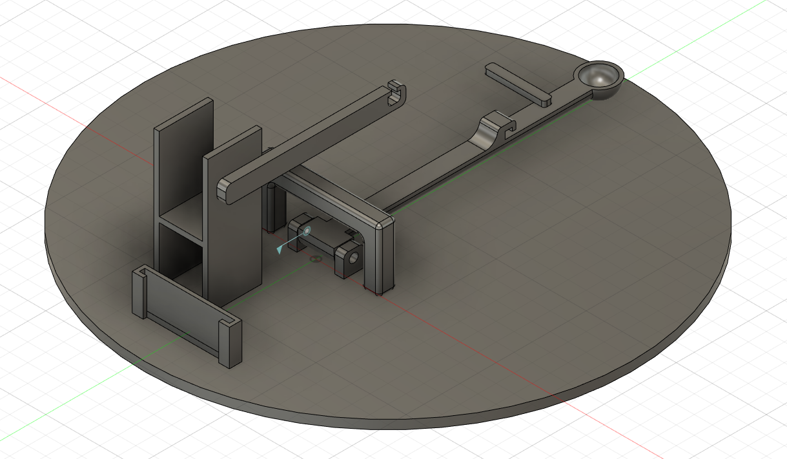

## Learning diary
### Summary of the idea:

Our idea is to make a device for throwing marbles. Initial concept was a catapult that was operated by servo, had ability to rotate, and responded to the distance of the target.

### Week 12

This week was mostly discussing and developing our idea for throwing marbles. Wednesday was our first discussion with whole group where we brainstormed what is presented in the introductory report.
On Friday we discussed the idea during the TA session and we got confirmation on our worries that servo might not be able to operate the arm well enough by itself. Also TA reminded us to focus on figuring out how we will impement the throwing before working on other functionalities. TA mentioned the trebuchet that was made few years back, however trebuchet uses counterweight to swing and the students used servo to pull the rope that pulled the arm back.

After the TA session we discussed the idea futher, this time exploring using springs to move the arm and sevro to tension it, we had a passing mention of this during discussion on wednesday and that was decided as possible back up if TA session confirmed servo insufficent. Discussing and researching implementations made by other people in the internet we updated the arm to be held down with a lever operated with servo, while another servo tensions the arm by rotating another arm that has a rubberband connected to the throwing arm. 

Rough sketch of the updated idea.

### Week 13

This week we started to actually work on the project. As the priority number one we started making a 3d model of the project after fiddling around with Autodesk Fusion 360, which is our software of choice for the project. What we managed to make was a basic structure of our throwing machine. What needs to be made is to modify the structure to fit the components. While working on the model trying to animate joints to simulate the throwing motion proved to be challenging. After some fumbling around some insight on how it works in Autodesk Fusion 360 was gained. However, satisfactory results are yet to be found, proving there is learning to do. 

Antti also picked up circuit design and code using Tinkercad as the platform. So far he has managed to implement 2 servos to roate in response to a button press. Later on third servo and potentiometer added to make rotation possible.  

First version of circuit design and code.

### Week 14 

During the TA session/mid-term presentation we got a tip to consider how we secure the components together and mto make sure the suupporting surface is adequate as well as considering using laser cutting for platform/box as it is a lot less time consuming. We made some quick adjustments to the 3d model based on those advices.

This week we finally recived our components for this project so it was time to build ciruit and test it in real life rather than in simulation. The circuit worked great on arduino as was expected. We had some concerns about the amount of torque a simple servo motor can provide so we made this test arm for the loading servo out of cardboard and tape. In the end of the loading arm there is two rubber bands that are tied together. After running some tests with this setup we can roughly say that the amount of torque the servo motor can provide isn't much. 

Test setup.

We already had some ideas on how to solve this problem if it becomes an issue. One solution would be to use cogwheels with the servo to decrease its range of motion but increase the torque the servo provides. We noted that servos moved 180 degrees so we decided to make cogs 2:3 ratio so we don't reduce the movement of the tensioning arm too much. We also shortened the tensioning arm a bit to reduce the load on it.

 

While designing the platform and the container/box for the container the friction and unbalance were to be concerned. Our solution to work around the issue was to make a simple ball bearing using the marbles that are spared the fate of being thrown.

Here is the arduino circuit with loading servo, release servo and the servo for rotating the catapult. The button on the breadboard controls the release and loading mechanism while the potentiometer is used to rotate the base of the catapult between 0 and 180 degrees.

Some progress also with circuit design and coding. Ultrasonic sensor and leds installed to the system. Depending of distance: one, two or three leds are on. 

Circuit design v2

### Week 15

This week we came to learn of possibility to get a more powerful servo for tensioning during TA session. Rather than jumping on the chance right away we decided to try out how our current implementation and mitigations work with what we currently have. 

3D models recieved some finishing touches with animations on gears/tensioning. Small changes were also made on how servo operating the lever holding throwing arm down is housed to make assembly/disassembly easier. We will first 3d print the tensioning to try out if bigger servo is needed, if it is the 3d model will be adjusted to it's size and then rest of the model is made.

We also started to make 2d design of the box to be laser cut.

Some testing with the code have been done also. Implementing automatic mode by reading distance and triggering based on that information seem to be too heavy code and at least on Tinkercad simulation causes lack of functionality. This need to progress more next week. 

### Week 16

3D prints were done theursday-friday are ready to be fetched monday. Instructor Mikko Toivonen checked the STL files for possible issues and gave them green light. Some parts were printed using Stratasys Fortus 380mc but majority were made using Formlabs Form 2. Which to use on which  part was based on the instructors judgement. The parts were left to be printed on thursday and on friday when checking the printing result and removing supports before hardening. 

  When removing supports on parts printed with Formlabs checks were made on the fit of some parts that needed to fit into each other. Connection between tensioning arm and larger gear was tight but it fit. However connection between the part connecting servo to the gear and the gear did not and required some "manual adjustments". Checking the 3D model to figure out how it was that one fit and the other didn't despite supposedly same tolerance, it was discovered that the part that didn't fit didn't have the tolerances set. That was either due to unwittingly undoing the adjustments while working on model or just forgetting to apply them on that part. The model and STL files were updated to have the tolerances to fit.
  
  Also we got to know the model of bigger servo (HS-322HD) and thus the 3d models and STL files were made to house it and ready for printing if needed.

Removing supports from parts on friday.
