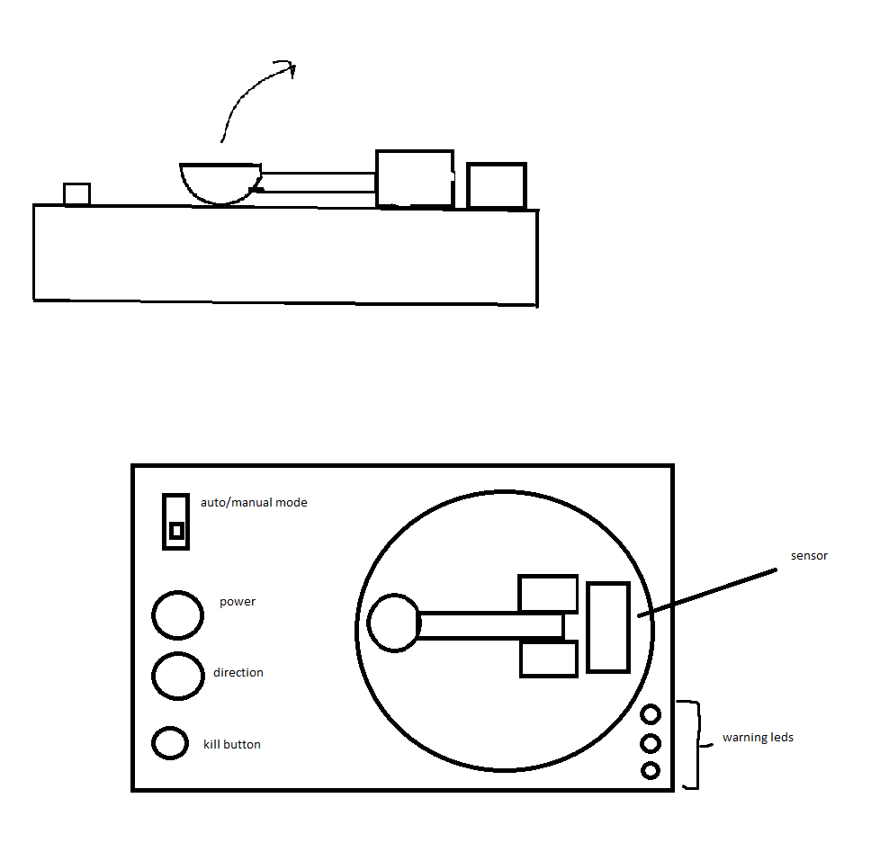

Our project idea is to make, true to it's name, a miniature catapult for throwing marbles. The idea is to have both manual and automatic trigger, and for the catapult to have power adjustment. Manual trigger would be a button and when switched to automatic it would trigger once target comes close enough. The thrower would also have 3 different leds to indicate target distance: green when it's far, yellow, when it's approaching launching distance but has yet to reach it and red for when it's close enouch to trigger launch.

The idea to create a marble throwing machine was inspired by the lecturer's mention of trebuchet during course introcuction as examples of what studens had created previously.Before deciding on the idea we few other ideas but they were practical and not so fun, thus the decision was made. throwing the marble was decided at the initial group forming during 15.3. lecture. The concept was further discussed and improved next week when we met to discuss again Wed 24.3. 

Our first group meeting on week 12 was about brainstorming the details for design and properties of the catapult, and where we should take the design in the beginning. 

Materials needed:

- Basic Arduino kit 
- Ultrasonic sensor

First scetch

Second, improved scetch after further deliberation.
